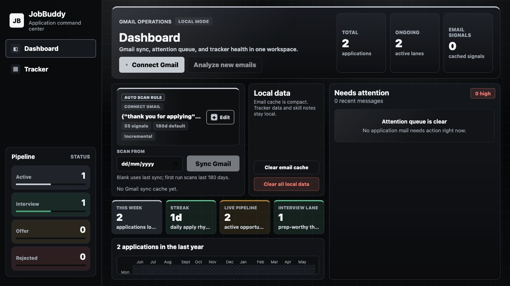
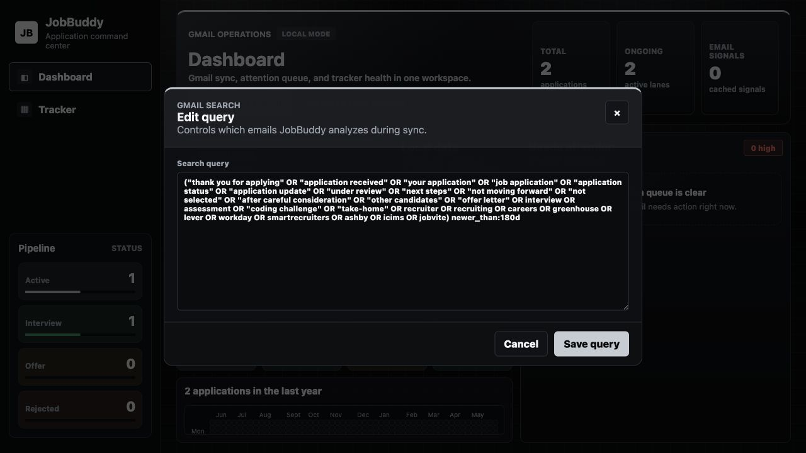
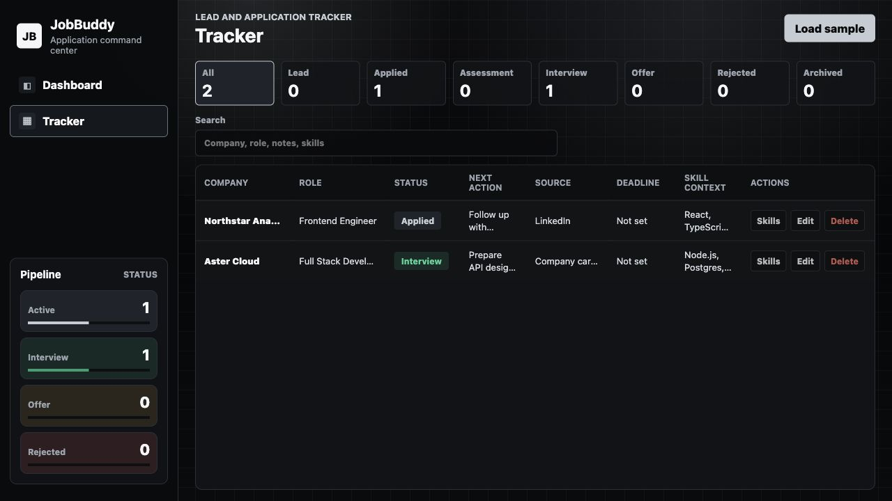
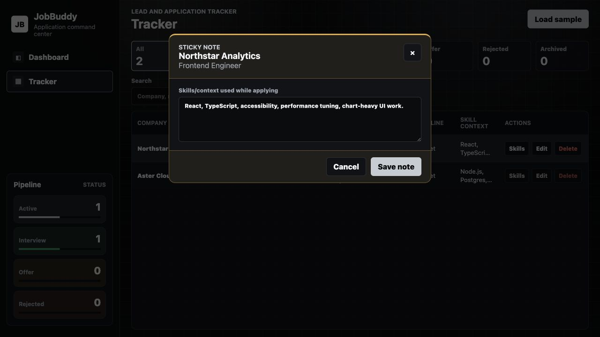
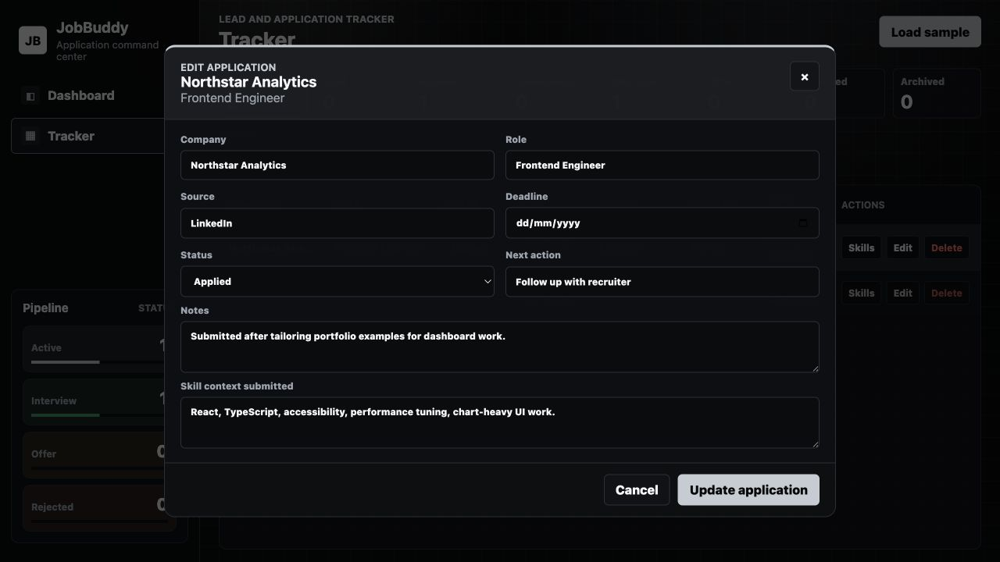

# JobBuddy

JobBuddy is a local-first React + TypeScript application for managing job search activity from one operational dashboard. It connects to Gmail with read-only access, scans application-related messages, classifies responses, builds a tracker automatically, and gives you a compact black-and-silver workspace for pipeline status, attention items, notes, and submitted skill context.

The goal is simple: reduce manual job-application bookkeeping and make Gmail-driven application tracking feel fast, clear, and trustworthy.



## What JobBuddy Does

- Syncs Gmail messages related to job applications using a configurable search rule.
- Analyzes application emails for status signals such as applied, assessment, interview, offer, rejection, follow-up, and needs review.
- Builds and updates a tracker automatically from synced emails.
- Keeps a local pipeline view for active, interview, offer, and rejected applications.
- Highlights recent application messages that need attention.
- Stores tracker data, notes, skill context, compact sync metadata, and the remembered Gmail connection locally in the browser.
- Supports manual editing when automated classification needs correction.
- Lets you save sticky-note style skill context for each application.
- Runs as a Vite React app in development or as a local production preview.

## Screenshots

### Dashboard And Gmail Sync

The dashboard is the main operating screen. It contains Gmail connection actions, the automated scan rule, local data controls, key focus metrics, application activity, and the attention queue. The current UI uses a strong black/silver theme, with color reserved for meaningful status signals.


### Gmail Search Rule Editor

The Gmail query is hidden by default to keep the dashboard clean. Use the edit button when you want to fine-tune what JobBuddy scans. The modal uses lightweight transform/opacity animation so it opens smoothly without expensive backdrop blur.



### Tracker

The tracker is designed as a dense CRM-style table. JobBuddy can create rows from Gmail sync, and you can still load sample data, filter by status, search, edit, delete, open the source email, or add skill notes.



### Skill Context Notes

Each application can have a sticky-note style skill context entry. This is useful for saving the exact skills, resume angle, or project framing used while applying.



### Edit Application

Tracker rows can be edited through an in-place modal instead of a permanent manual form. This keeps the tracker focused on review and correction rather than data entry.



## Tech Stack

- React 19
- TypeScript with strict compiler settings
- Vite
- Local storage persistence
- Gmail API integration through Google Identity Services
- Utility-first architecture: components stay mostly presentational, and application logic lives in typed utilities

## Project Structure

```text
src/
  components/
    layout/              Shared shell and navigation
  features/
    dashboard/           Dashboard, analytics, attention queue, sync controls
    email/               Gmail sync UI and email analysis components
    notes/               Canvas-style notes workspace
    tracker/             CRM-style application tracker
  types/                 Strict domain types
  utils/                 Business logic, guards, Gmail parsing, storage, analytics
```

## Local Storage Model

JobBuddy is local-first. Data is stored in browser local storage under versioned keys:

```text
jobbuddy.applications.v1
jobbuddy.emailSignals.v1
jobbuddy.notes.v1
jobbuddy.gmailSyncCache.v1
jobbuddy.gmailAccessSession.v1
```

The app includes local clearing actions:

- Clear email cache: removes stored email signals and Gmail sync metadata.
- Clear all local data: removes applications, email signals, notes, and sync metadata.

## Gmail Sync Behavior

JobBuddy uses a Gmail search query to pull relevant application-related email. The default query is broad and scans the last 180 days on the first run. After a successful sync, JobBuddy stores the last synced timestamp locally and can build incremental Gmail queries from that point.

The app remembers the Gmail connection locally for up to 7 days. Google access tokens still expire quickly, usually around an hour, so JobBuddy attempts silent token renewal inside the 7-day remembered window. If Google revokes the session, expires it, or blocks silent renewal, click `Connect Gmail` again.

The Gmail connection uses read-only scope:

```text
https://www.googleapis.com/auth/gmail.readonly
```

## Gmail Setup

1. Create or open a Google Cloud project.
2. Enable the Gmail API for that project.
3. Configure the OAuth consent screen.
4. Create an OAuth Client ID for a web application.
5. Add these authorized JavaScript origins:

```text
http://localhost:5173
http://127.0.0.1:5173
http://127.0.0.1:4173
```

6. Copy `.env.example` to `.env`.

```bash
cp .env.example .env
```

7. Set your OAuth client ID:

```text
VITE_GOOGLE_CLIENT_ID=your-google-oauth-client-id.apps.googleusercontent.com
```

8. Start JobBuddy and click `Connect Gmail` from the dashboard.

## Run In Development

```bash
npm install
npm run dev
```

Vite will print the local development URL, usually:

```text
http://localhost:5173/
```

## Run As A Local App

Build and serve the production version locally:

```bash
npm run local:app
```

Or double-click the launcher on macOS:

```text
scripts/start-jobbuddy.command
```

The local app runs at:

```text
http://127.0.0.1:4173/
```

Keep the terminal window open while using the local app.

## Available Scripts

```bash
npm run dev
npm run build
npm run typecheck
npm run screenshots
npm run local:serve
npm run local:app
```

## Updating Screenshots

Start the app, then run the screenshot capture script:

```bash
npm run dev -- --host 127.0.0.1 --port 5173
npm run screenshots
```

If you are using a different local URL, pass it with `JOBBUDDY_SCREENSHOT_URL`:

```bash
JOBBUDDY_SCREENSHOT_URL=http://127.0.0.1:5180/ npm run screenshots
```

The script uses local Chrome through the DevTools protocol and writes PNG files to `docs/screenshots/`.

## Current Product Scope

JobBuddy currently focuses on two primary screens:

- Dashboard: Gmail sync, scan rule, attention queue, local data controls, and application activity.
- Tracker: CRM-style application table with filters, search, email links, editing, and skill notes.

## Notes On Privacy

- Gmail access is read-only.
- The remembered Gmail access session is stored in browser local storage for up to 7 days.
- Application data, notes, cached email signals, sync metadata, and Gmail session metadata stay in browser local storage.
- Use `Clear all local data` if you want to remove JobBuddy's local tracker data and cached sync data from the browser.
- `.env` is ignored by git so your OAuth client ID is not committed.

## Verification

Before pushing this version, the app was verified with:

```bash
npm run build
./node_modules/.bin/tsc -p tsconfig.app.json
```

## Roadmap

- Improve low-confidence email classification review.
- Add richer follow-up and assessment action detection.
- Add export/import for tracker and notes.
- Add optional reminder automation for follow-ups.
- Add more resilient Gmail sync reporting and conflict handling.
- Add responsive improvements for smaller screens.
